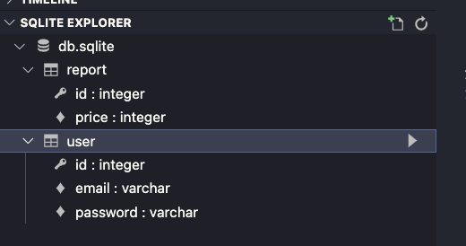

<p align="center">
  <a href="http://nestjs.com/" target="blank"></a>
</p>

[circleci-image]: https://img.shields.io/circleci/build/github/nestjs/nest/master?token=abc123def456
[circleci-url]: https://circleci.com/gh/nestjs/nest

## Description

[Nest](https://github.com/nestjs/nest) framework TypeScript starter repository.

## Extensions

- REST Client extension vscode

## Installation

```bash
$ yarn install
```

## Running the app

```bash
# run localhost:4002
# development
$ yarn run start

# watch mode
$ yarn run start:dev

# production mode
$ yarn run start:prod
```

## Test

```bash
# unit tests
$ yarn run test

# e2e tests
$ yarn run test:e2e

# test coverage
$ yarn run test:cov
```

## Open sqlite

```bash
# install extension
install sqlite extensions

# open database vscode
go to View → Command Palette → choose SQLite: open database
```



## Requirement

- User sign up with email/password
- User get an estimate for how much their car is worth based on the make/model/year
- User can report what they sold their vehicle for.
- Admin have to approve reported sales.

## API Design

### Sign up

```bash
# sign up user
POST /auth/signup
Body or Query String
{
  email: string
  password: string
}
```

### Sign in

```bash
# sign in user
POST /auth/signin
Body or Query String
{
  email: string
  password: string
}
```

### Report

```bash
# get an estimate for the car
GET /reports
Query String: make, model, year ...

# report how much a vehicle sold
POST /reports
Body
{
  make: string
  model: string
  year: string
  ...
}

# approve or reject a report
PATCH /reports/:id
Body
{
  approved: boolean
}
```
